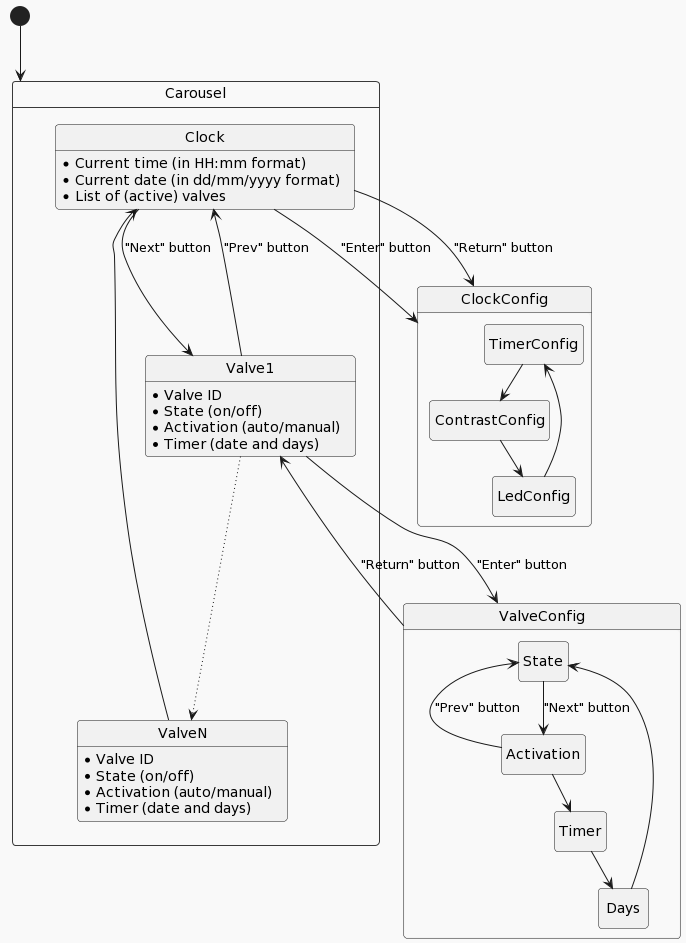

# xt-valve-timer
Arduino-based 24V solenoid valves control unit for home domotic

## Hardware

### NOKIA 8544 LCD monitor
Alternative device: Adafruit PCD8544

* Size: 83x48
* Power supply: 3.3V
* GPIO (fontal view, left-to-rigth)
  1. RES
  2. VOUT
  3. GND
  4. SCE
  5. D/C
  6. SDIN
  7. SCK
  8. VDD

## Mega2560 + WiFi R3 ATmega2560 + Setup ESP8266  

Action | 1 | 2 | 3 | 4 | 5 | 6 | 7 | 8 | RXD/TXD |
--- | --- | --- | --- | --- | --- | --- | --- | --- | --- |
USB <-> ESP8266 (Update firmare or sketch) | OFF | OFF | OFF | OFF | ON | ON | ON | OFF | RDX0
USB <-> ATmega2560 <-> ESP8266 | ON | ON | ON | ON | OFF | OFF | OFF | OFF | RDX3 |

Usefull links:
* [instructables](https://www.instructables.com/Arduino-MEGA-2560-With-WiFi-Built-in-ESP8266/)
* [medium](https://thilina-gunarathna.medium.com/mega-wifi-r3-atmega2560-esp8266-web-client-troubleshooting-fbfae9d15c26)

## Software

### State machine workflow

